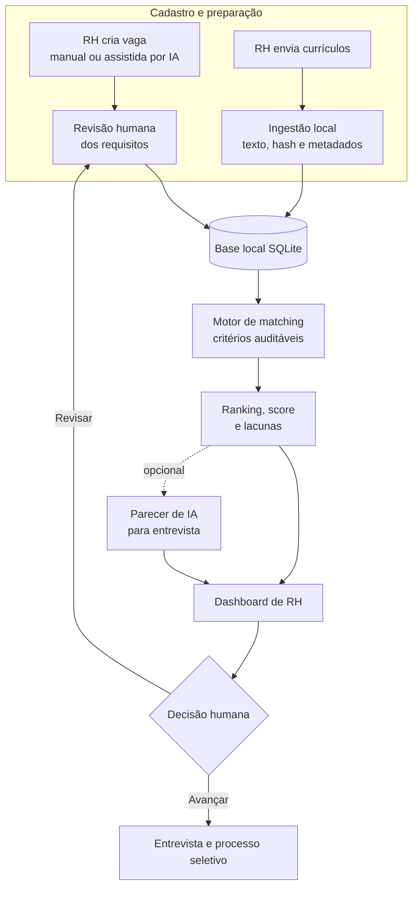

# RH Inteligente

MVP de apoio ao recrutamento e seleção. O projeto transforma currículos e requisitos de vagas em um ranking auditável e, opcionalmente, em pareceres de IA para apoiar entrevistas.

> O sistema apoia pessoas recrutadoras; ele não toma decisões de contratação. Toda recomendação precisa de revisão humana.

## O problema

Triar muitos currículos exige tempo e pode tornar a comparação inconsistente. O RH Inteligente organiza as evidências de aderência de cada perfil a uma vaga, mostra como a pontuação foi formada e sugere pontos para aprofundar na entrevista.

## O que a aplicação entrega

- Geração de **300 currículos sintéticos** e **10 vagas fictícias** para demonstração.
- Ranking por critérios explícitos: tecnologias, requisitos, experiência, área, formação, idiomas e diferenciais desejáveis.
- Explicação do score, competências evidenciadas e lacunas a validar.
- Dashboard Streamlit com áreas separadas para acompanhamento, criação de vagas e cadastro de candidatos.
- Criação manual de vagas ou geração de rascunho com IA (Ollama local ou OpenAI), sempre com revisão humana antes da publicação.
- Recebimento local de currículos, com hash do arquivo e histórico de ações para rastreabilidade.

## Como funciona



O ranking é calculado antes da IA e continua disponível sem chave de API. A IA pode ajudar a redigir um rascunho de vaga ou enriquecer a leitura do resultado, mas não altera a posição ou a nota de candidatos. A criação da vaga e qualquer decisão sobre pessoas permanecem sob responsabilidade humana.

## Tecnologias

Python 3.11+, Pydantic, Pandas, OpenAI API, Streamlit e Pytest.

## Banco de dados local

O projeto usa SQLite para persistir candidatos, vagas e rankings em `data/rh_inteligente.db`. O arquivo é criado e sincronizado automaticamente ao abrir o dashboard ou atualizar os rankings. Como pode conter dados pessoais, ele é ignorado pelo Git.

Para sincronizá-lo manualmente:

```powershell
python -m services.database
```

O SQLite foi escolhido para a execução local. Em uma implantação multiusuário ou em nuvem, a mesma camada pode ser migrada para PostgreSQL.

## Execução local

### 1. Preparar o ambiente

```powershell
python -m venv .venv
.venv\Scripts\Activate.ps1
pip install -r requirements.txt
```

### 2. Gerar ou atualizar os dados de demonstração

```powershell
python -m generators.curriculos
python -m generators.gerar_vagas
python -m services.matching --top 30
```

Os rankings serão gravados em `data/resultados/`.

### Receber currículos reais em arquivos

Coloque os arquivos recebidos na pasta `curriculos/`. A ingestão suporta PDF com texto selecionável, DOCX, TXT, Markdown e JSON. Em seguida, execute:

```powershell
.\.venv\Scripts\python.exe -m services.ingestao_curriculos
```

Cada currículo vira um JSON bruto rastreável em `data/curriculos_processados/`, com texto extraído, hash do arquivo e metadados. Essa etapa é local e não envia o currículo para IA. PDFs digitalizados como imagem precisam de OCR e arquivos `.doc` antigos precisam ser convertidos para DOCX ou PDF antes da ingestão.

Para simular o recebimento de arquivos sem usar dados reais, gere currículos fictícios diretamente nessa pasta:

```powershell
.\.venv\Scripts\python.exe -m generators.curriculos_documentos --total 5 --formato ambos
```

> A normalização de currículos reais para o ranking ainda requer validação de dados e definição do processo de consentimento e LGPD. Por isso, os JSONs brutos não entram automaticamente no matching.

### 3. Gerar pareceres com IA (opcional)

Copie `.env.example` para `.env` e escolha o provedor. Para rodar localmente, instale o [Ollama para Windows](https://docs.ollama.com/windows), execute `ollama run gemma4` uma vez e mantenha `IA_PROVIDER=ollama`. Para usar a API da OpenAI, defina `IA_PROVIDER=openai` e preencha `OPENAI_API_KEY`.

```powershell
python -m services.analise --vaga VAG-0001 --top 10
```

Nenhum contato ou localização do candidato é enviado à IA. Os arquivos `.env` e resultados são ignorados pelo Git.

### 4. Abrir o dashboard

```powershell
streamlit run dashboard/app.py
```

Use a barra lateral para acessar as tarefas:

- **Visão executiva**: indicadores e prioridades do portfólio de vagas.
- **Acompanhamento de vagas**: ranking, detalhes de candidatos e pareceres opcionais.
- **Criar vagas**: criação manual ou rascunho assistido por IA. Revise todos os campos antes de criar a vaga e atualizar o ranking.
- **Cadastrar candidatos**: envio e processamento local de currículos, além do histórico de rastreabilidade.

Para criar um rascunho com IA, selecione o provedor configurado. Ollama mantém a geração no computador local; OpenAI requer `OPENAI_API_KEY` no arquivo `.env` e pode gerar custos conforme o uso. Não envie dados pessoais de candidatos na descrição da vaga.

## Roteiro de apresentação (5 minutos)

1. Abra **Visão executiva** e apresente os processos ativos e prioridades.
2. Acesse **Criar vagas** e mostre o rascunho assistido por IA, reforçando a revisão humana.
3. Em **Cadastrar candidatos**, mostre que o arquivo permanece local e gera rastreabilidade.
4. Em **Acompanhamento de vagas**, apresente o score, as evidências e as lacunas de um candidato.
5. Se houver parecer gerado, mostre as perguntas sugeridas para entrevista.
6. Reforce que a decisão final é humana e que a IA não substitui a avaliação profissional.

## Estrutura do projeto

```text
app.py                 Ponto de entrada do motor de matching
models/                Contratos de candidatos, vagas, resultados e pareceres
generators/            Dados sintéticos para demonstração
services/              Scoring, matching, ingestão, persistência e operações do dashboard
integrations/          Clientes para OpenAI e Ollama
prompts/               Instruções para pareceres e rascunhos de vagas
dashboard/             Interface Streamlit
data/                  Dados de entrada e resultados locais
tests/                 Testes automatizados
docs/                  Documentação técnica e roteiro do dashboard
```

## Qualidade e limitações do MVP

- Os dados são sintéticos e não devem ser usados para decidir sobre pessoas reais.
- O modelo identifica evidências textuais; ausência de evidência não é prova de ausência de competência.
- Antes de uso real, é necessário validar critérios, LGPD, segurança, vieses, consentimento e integração com a política de RH.
- A recomendação da IA deve ser revisada por uma pessoa recrutadora.

## Próximas evoluções

1. Filtros, busca e comparação lado a lado de candidatos.
2. Edição, arquivamento e status de vagas.
3. Autenticação e perfis de acesso.
4. Avaliação de qualidade do ranking e monitoramento de vieses.
5. Integração com ATS, mediante requisitos de segurança e privacidade.
